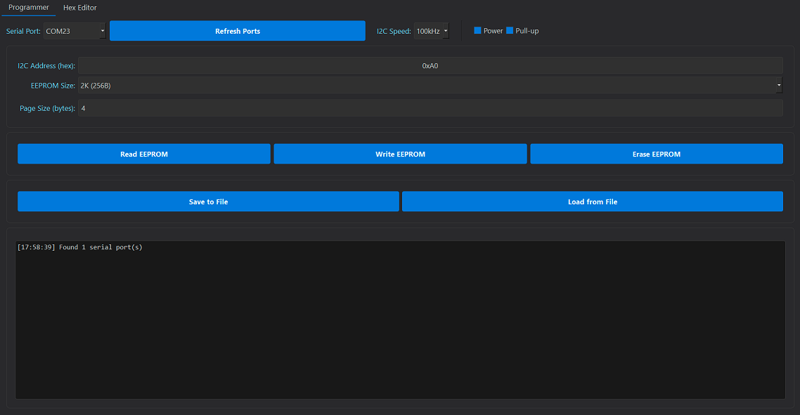
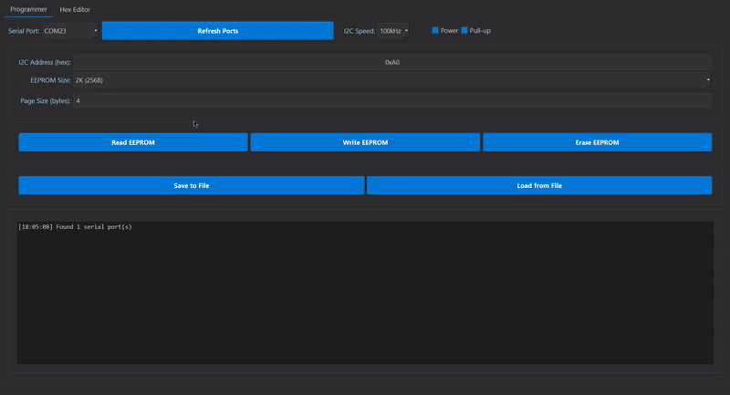

  
  <h1> 🌟 BP Programmer 🌟 </h1>

## 📚 Table of Contents
- [🚀 What Can You Do with This?](#-what-can-you-do-with-this)
- [📦 How to Install?](#-how-to-install)
- [🎉 Final Outcome](#-final-outcome)
- [🙏 Acknowledgments](#-acknowledgments)
- [❤️ Support the project](#-support-the-project)
- [🌐 Follow Me for Updates](#-follow-me-for-updates)

-----

## 🚀 What Can You Do with This?
This program allows you to flash EEPROM memory using **Bus Pirate** via the following protocols:
- **I2C**
- **(The remaining protocols will be added soon)**

-----

## 📦 How to Install?

<strong>Python Method</strong>

- Install Python on your system
- Enter the command `pip install -r requirements.txt` to install the necessary libraries
- Run the `BP_Programmer.py` file from src folder

<strong>Executable Method</strong>

- Just download the precompiled **.exe** file from the [releases](https://github.com/W0rthlessS0ul/BP_Programmer/releases) section

-----

## 🎉 Final Outcome
### App Appearance

### I2C Flash

-----

## 🙏 Acknowledgments
- [juhasch](https://github.com/juhasch/pyBusPirateLite) - **for creating a great library for Bus Pirate**

-----

## ❤️ Support the project
If you would like to support this project, please consider starring the repository or following me! If you appreciate the hard work that went into this, buying me a cup of coffee would keep me fueled! ☕ 

**BTC Address:** `bc1qvul4mlxxw5h2hnt8knnxdrxuwgpf4styyk20tm`

**ETH Address:** `0x5c54eAb2acFE1c6C866FB4b050d8B69CfB1138Af`

**LTC Address:** `LbdzCsYbxuD341raar6Cg1yKavaDq7fjuV`

**XRP Address:** `rKLLPzoBGfqY3pAQPwTFPRYaWjpHSwHNDw`

**ADA Address:** `addr1qyz2aku0ucmxqnl60lza23lkx2xha8zmxz9wqxnrtvpjysgy4mdcle3kvp8l5l7964rlvv5d06w9kvy2uqdxxkcryfqs7pajev`

**DOGE Address:** `DBzAvD62yQUkP4Cb7C5LuFYQEierF3D3oG`

Every donation is greatly appreciated and contributes to the ongoing development of this project!

---

## 🌐 Follow Me for Updates
Stay connected to receive the latest updates:

